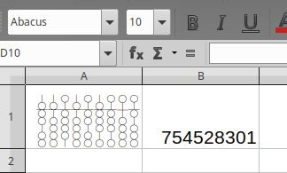

# abacus-font
A small font that replaces Hindu-Arabic numerals with columns of an abacus.

Note: This font only includes the glyphs for 0-9. It can be used to replace the numerals 0-9 in a more complete font.
